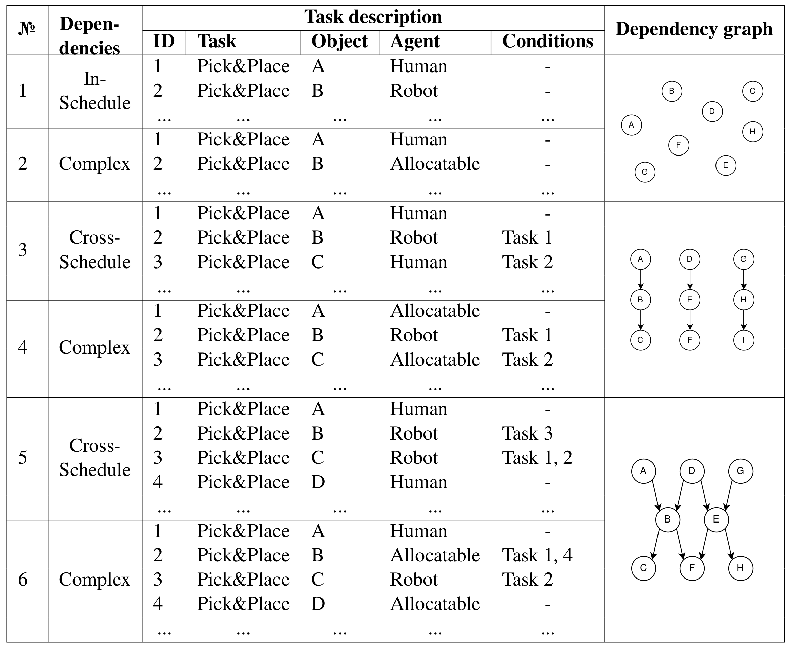

# Scheduling and reactive control in HRC

The block presented in this repository is designed for scheduling tasks between a human and a robot and adapting it in case of changes triggered by uncertainties.  

## About scheduling 
Scheduling is an integer constraint programming problem that is solved by using [Google Optimization Tools][about-ortool]

[about-ortool]: https://github.com/google/or-tools

## Installation 

Create conda environment:
```
conda create -n msched python=3.10
conda activate msched
pip install -r requirements.txt
```


## Quick Start
You can choose one of these cases:


### Run simulation
The application will open online graph and in the ordterminal will show the status of agents.
```
python main.py [case]
```
positional arguments: <br />
  case - 1, 2, 3, 4, 5, 6

options:: <br />
*-h, --help* show this help message and exit
*--only_schedule* create scheduling without running simulation
*--animation* create a video after simulation

### Replay graph offline
After running simulation, you can view the Gantt Chart of initial and final schedule.
```
 python main_plot.py 
```
positional arguments:<br />
mode - Select the mode you want to render: sim_vis or plot_schedule

options: <br />
*-h, --help* show this help message and exit
## Change settings

`sim/config.json`

Simuletion has 3 paramters. Two of them use the random function, so to be able to repeat the result, use the seed.

* *Seed* - ramdom seed
* *Allocation weights* - Weights determining with what probability there will be a task only for a person P(human), only for a robot P(robot), for both P(both).
* *Fail probability* - Probability of long delay due to fail or error.


